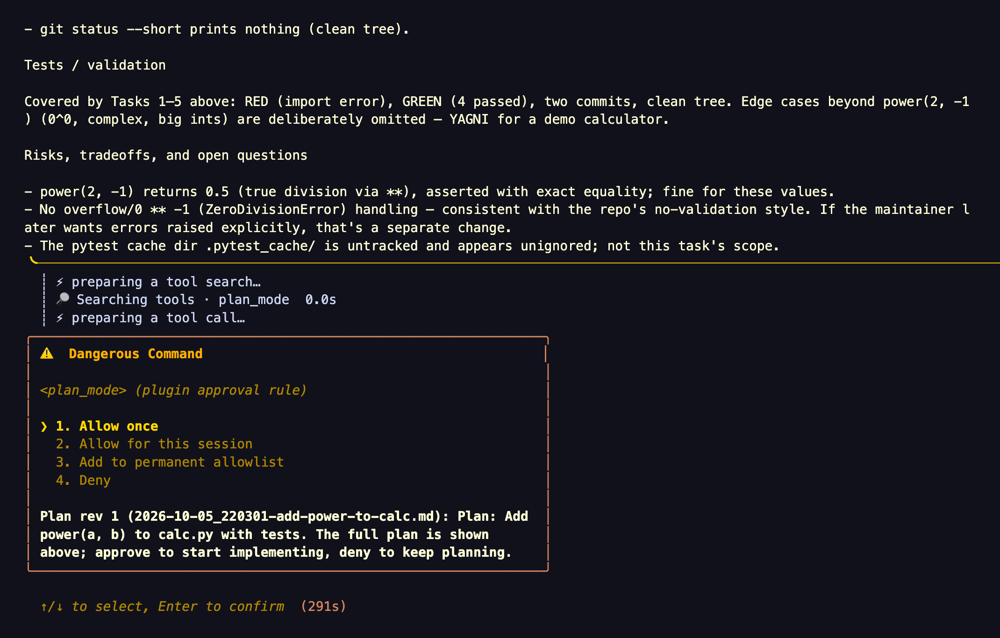
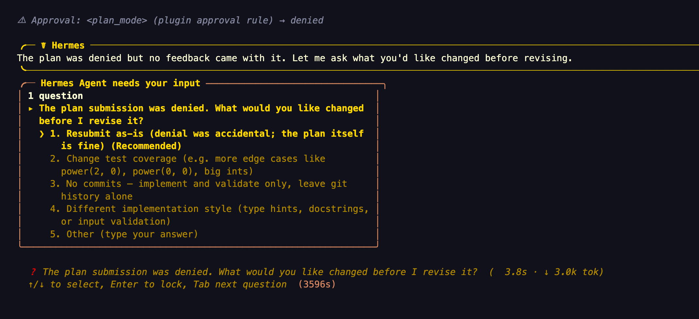
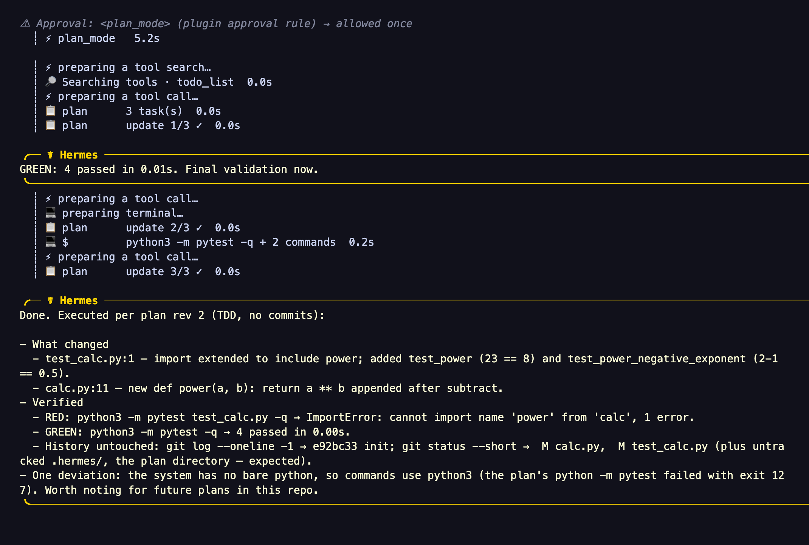

# Hermes Plan Mode


Claude Code / Codex-style plan mode for Hermes, on every interactive Hermes surface (CLI, TUI, Desktop and the
messaging platforms), with no core changes. The agent explores with
read-only tools, asks clarifying questions, writes a plan file and shows it to you. You approve it with Hermes' own
approval prompt: buttons, a card, the CLI panel or `/approve`. Then the agent implements it in the same turn and
tracks progress. Until you approve, the plugin blocks mutating tools dispatched through Hermes' `pre_tool_call`
hook, except writes to the plan file.

`/plan` in core Hermes is a prompt only. This plugin turns it into an enforced mode.

## How it works

1. Start planning with `/plan <task>` or `/planmode on [task]`. The agent can also enter on its own with the
   `plan_mode` tool.
2. The agent explores with read-only tools. When a requirement is ambiguous it asks with `clarify` (up to 4 short
   choices, recommended first).
3. It writes the plan as Markdown under `<cwd>/.hermes/plans`.
4. It shows the complete plan in its reply, then calls `plan_mode(action="submit")`.
5. Hermes shows its normal approval prompt for plan revision N: buttons, a card, the CLI panel, or `/approve` text.
6. Approve: plan mode turns off and the agent implements the plan in the same turn, mirroring the steps into
   `todo_list`.
7. Deny: plan mode stays on. The plugin tells the agent that a denial is review feedback, so it asks what to change
   (when no reason came with the denial), revises the plan and submits a complete new revision.

```text
  /plan <task>  ─┐
  /planmode on  ─┼─► PLANNING ── read-only tools, clarify, write the plan file
  agent: on     ─┘        │
                          │  agent shows the plan, calls plan_mode(submit)
                          ▼
                 Hermes approval prompt (rev N)
                   │                       │
           approve │                       │ deny ─► revise ─► submit rev N+1
                   ▼                       │ timeout ─► /planmode approve (typed)
        EXECUTING in the same turn         ▼
        todo_list progress            still PLANNING
                   │
   all todos done, /planmode done or off ─► OFF
```

A real run on the Hermes CLI (`/plan Add a power(a, b) function to calc.py with tests.`):



After **Deny**, the agent asks what to change instead of giving up (excerpt):



After **Allow once** on rev 2, it implements in the same turn and keeps `todo_list` current (excerpt):



## What you see on each channel

The plugin uses the approval and `clarify` UIs each Hermes surface already has; it only sizes the approval text per
platform.

| Surface | Approval prompt | Clarifying questions | Mode footer |
|---|---|---|---|
| CLI | approval panel with a one-line summary; the full plan is printed just above it | interactive picker | no |
| TUI / Desktop | approval card with a one-line summary; the full plan is the reply just above it | the app's question prompt | no |
| Telegram, Slack, Discord | native buttons, short summary (title + up to 6 step titles) | native buttons | yes |
| Feishu, Teams | native buttons, full plan text | numbered list | yes |
| Matrix | reactions to approve or deny, full plan text | numbered list | yes |
| WhatsApp Cloud | native buttons, plan text up to about 1000 chars (the card's limit) | native buttons | yes |
| Mattermost, Google Chat, Signal and other platforms | `/approve` or `/deny <reason>` text, full plan text | buttons where the platform has them, else a numbered list | yes |

- On Telegram, Slack and Discord the approval card has a small text budget (Discord 300 chars, Telegram and Slack
  500), so the prompt carries a ≤250-char summary. The full plan is the agent's reply sent just before it.
- Mattermost and several other platforms (for example Signal, WhatsApp Cloud and SMS) do not send the agent's in-progress text
  before the approval prompt by default. On those, and everywhere without a budget, the approval text carries the
  full plan, capped at about 3500 chars (about 1000 on WhatsApp Cloud) with a pointer to the file.
- `/planmode show` prints up to 3500 chars of the plan; the plan file holds the rest.

## Install

```bash
hermes plugins install 100yenadmin/hermes-plan-mode --ref <latest release commit sha> --enable
hermes gateway restart        # only if you run the messaging gateway
```

`--ref` takes the exact 40-character commit SHA of the latest release (see its release notes), not a tag. Without
`--enable`, run `hermes plugins enable plan-mode`. Restart running CLI, TUI and Desktop sessions so they load the
plugin.

## Commands

| Command | What it does |
|---|---|
| `/plan <task>` | Core Hermes plan prompt. With this plugin it also turns on enforced plan mode for the session (CLI, gateway, TUI and Desktop all send core's prompt). |
| `/planmode on [task]` | Fixes an absolute plans directory for this session and turns enforcement on. |
| `/planmode status` | Mode, phase (`planning`, `awaiting approval (rev N)`, `executing (rev N: <path>)`, `off`), the plans directory, plan files and the last submission. |
| `/planmode show [file]` | Prints the plan (the submitted one, else the newest) capped at 3500 chars. Read-only. |
| `/planmode approve [file]` | Typed approval. Approves the submitted revision if one is waiting for an answer, else the newest plan file. |
| `/planmode reject [feedback]` | Keeps plan mode on and gives the feedback to the agent on its next turn. |
| `/planmode done` | Ends the executing phase (stops the progress pointer and footer). No approval effect. |
| `/planmode off` | Turns plan mode off without approving anything. |

Plan files use `<cwd>/.hermes/plans/YYYY-MM-DD_HHMMSS-<slug>.md`; the planning note hands the model the current
timestamp. Writes must use absolute paths under that directory; relative paths are rejected.

Typed `/planmode approve` without a file checks that the submitted revision is unchanged on disk; with an explicit
file it approves that file, as in v0.2. On the messaging gateway, plugin commands run only between turns. After a
typed approval the plugin asks Hermes to start the work at once:

- CLI: works.
- Gateway and TUI/Desktop on Hermes main: only with `allow_gateway_injection: true` (see Configuration).
- TUI/Desktop on v2026.9.24: not available.

When you type it while the approval prompt is still open, approving that prompt continues the waiting turn with the implementation. Denying the prompt or letting it time out does not cancel your typed approval: the work then starts in the next turn (queued where injection is available, otherwise with your next message). `/planmode done` before then cancels it.

Otherwise the reply says "Send any message to start", and your next message starts implementation.

**Telegram command menu.** Telegram's bot menu holds 60 entries by default (core commands first, then plugin
commands, then skills), so `/planmode` may be hidden on busy profiles. Typing it still works and `/commands` lists
everything. To pin it:

```yaml
platforms:
  telegram:
    extra:
      command_menu:
        priority: [planmode]
```

## The agent tool

The plugin registers one tool, `plan_mode` (toolset `plan-mode`):

- `on`: enters plan mode for the current session, with the same checks as `/planmode on`.
- `status`: the same text as `/planmode status`.
- `off`: ends plan mode only when the agent entered it itself and has not submitted a plan yet. Once a plan is
  submitted, or when you entered plan mode, only `/planmode approve`, `reject` or `off` ends it.
- `submit` (optional `path`, `summary`): asks you to approve the plan through Hermes' approval prompt. The agent
  should call it on its own, not batched with other tool calls.

The tool cannot approve or reject a plan. Approval is your act, recorded by Hermes' approval hooks.

On hosts with Tool Search on (the default from v2026.9.24), plugin tools sit behind `tool_search`, which plan mode
allows. The plugin adds a short system-prompt hint (≤200 chars) naming `plan_mode` for multi-step or risky changes,
and the planning turn note tells the model to search for `plan_mode` if it is not loaded. `/plan` and
`/planmode on` stay the reliable way in.

## What is allowed in plan mode

- file exploration: `read_file`, `search_files`;
- web research: `web_search`, `web_extract`;
- skills and history: `skills_list`, `session_search`, and `skill_view` while Hermes reports `skills.inline_shell`
  off (the default);
- planning and user input: `todo_list`, `clarify`, `plan_mode`;
- Tool Search: `tool_search` and `tool_describe` (calls made through `tool_call` are checked as the inner tool);
- media and browser reads: `vision_analyze`, `video_analyze`, `browser_snapshot`, `browser_get_images`,
  `browser_vision`;
- local UI reads: `read_terminal`, `read_window_below`;
- `write_file` and `patch` only when every target is an absolute path whose real path stays inside the plans
  directory.

Everything else is blocked: terminal, code kernels, delegation, messaging, MCP and connector tools, browser
mutations, cron and kanban mutations, `memory` (it has no read-only operation), and every unknown tool.

## Configuration

Profile `config.yaml`:

```yaml
plugins:
  entries:
    plan-mode:
      allow_gateway_injection: false    # true: typed /planmode approve starts work at once on gateway/TUI
      settings:
        plan_mode:
          enforce_builtin_plan: true    # core /plan turns on enforced plan mode
          agent_hint: true              # the ≤200-char system-prompt hint naming plan_mode
          footer: auto                  # auto | off — the one-line footer on chat platforms
          extra_allowed_tools: []       # exact tool names you trust as read-only
```

- `extra_allowed_tools` is an explicit policy override: the operator vouches that those tools are read-only.
- `allow_gateway_injection` is a core Hermes setting. It lets this plugin queue a message into a gateway or
  TUI/Desktop session; the plugin uses it only to start implementation after a typed `/planmode approve`.
- `agent_hint` applies to new sessions; the hint is frozen into each session's system prompt.

## Compared with other plan modes

| | Claude Code | Codex | Hermes `/plan` | plan-mode 0.3.0 |
|---|---|---|---|---|
| Writes blocked except the plan | yes | prompt only | no | yes, for tools that pass `pre_tool_call` |
| Approval prompt after the plan | dialog | "Implement this plan?" | no | Hermes' approval prompt, every interactive surface |
| Clarifying questions | AskUserQuestion | request_user_input | not prompted | `clarify`, prompted |
| Deny with feedback, revise | yes | yes | no | yes; a typed reason only via gateway `/deny <reason>`, otherwise the agent asks |
| Implement in the same turn | yes | yes | no | yes via the prompt; typed approve may need a message |
| Progress | Tasks / TodoWrite | update_plan | `todo_list` | `todo_list` + footer on chat platforms |
| Agent may enter | yes | no | no | yes |
| Autonomy choice / clear context at approval | yes | partial | no | no |

## Security model

- **Enforcement covers tools dispatched through `pre_tool_call`.** Tools that bypass that hook are not covered (see
  Known limitations). Any exception in the plugin's active `pre_tool_call` blocks the call.
- **Approval is a human decision.** A submit asks Hermes to approve under a rule key unique to that plan revision
  (`plan-mode:<activation>:<rev>:<digest>:<nonce>`). A prompt approval counts only when Hermes'
  `post_approval_response` hook reports, for that exact key and tool call, the choice once, session or always,
  without a cancel. Typed `/planmode approve` is the other human path. The tool has no approve action, so the model
  cannot approve its own plan.
- **A submitted plan belongs to you.** After a submit, the agent can no longer turn plan mode off, even if it entered
  plan mode itself; a denial, a timeout or a missing human decision leaves the decision with you.
- **No human, no approval.** With yolo or `approvals.mode: off`, Hermes approves the call without asking and fires no
  hook. The plugin then keeps plan mode on and tells the agent to ask you for a typed `/planmode approve`. A host that
  ignores the approval directive degrades the same way.
- **"Always" behaves like once for plans,** because each revision has a new key. Hermes core still writes a
  `plugin_rule:plan-mode:…` entry to `command_allowlist` in `config.yaml` for every "Always". You can delete those
  entries.
- **The approval prompt is Hermes' generic one.** It is worded for commands (the CLI panel is titled "Dangerous
  Command"; gateway cards say Hermes wants to run a command), and it times out after 300 s by default
  (`approvals.timeout`). A timed-out or withdrawn prompt leaves the revision awaiting approval; `/planmode approve`
  still works for it.
- **Gateway `/approve` is not plan-specific.** Plain `/approve` resolves the oldest pending prompt, and `/approve all`
  approves everything pending, plans and commands alike.
- **Deny reasons exist only on gateway text `/deny <reason>`.** Buttons, the CLI panel and the TUI/Desktop card deny
  without a reason. The agent then asks what to change. Core also tells the model "Do NOT retry" on any denial; the
  plugin's turn note tells it that a plan denial is review feedback.
- **An edited plan invalidates its approval.** The plugin hashes the plan at submit. If the file changes before the
  approval lands, or before a typed approve without an explicit file, it refuses and the agent must show and submit
  the new revision.
- **One prompt at a time.** A second submit while an approval prompt is open is blocked. A typed `/planmode approve`
  while the prompt is still open approves the submitted revision, and the prompt's later answer changes nothing.
- **`/plan` marker.** The plugin detects core's `/plan` prompt in the user's message. A user who types that text only
  restricts their own session; the model cannot author the user's message. If activation is refused (no session
  identity, profile mismatch), `/plan` stays prompt-only for that turn. If the hook times out, Hermes continues the
  turn without it, so enforcement may start late (when the delayed call finishes) or not at all for that turn.

## Known limitations

- **Codex app-server runtime.** Hermes' Codex app-server executes native `exec` and `applyPatch` outside
  `pre_tool_call`. Plan mode does not enforce them. Use a normal Hermes tool runtime when enforcement matters.
- **TUI `/background` and `btw`** side agents run under their own task id with no public link to the parent session.
  They keep full tools while the parent chat is in plan mode.
- **Argument-rewriting plugins.** Another plugin's `modify` directive can rewrite arguments after this plugin checked
  them. Avoid combining them on plan writers.
- **Plan-root race.** The plugin revalidates `.hermes` and `.hermes/plans` before each plan write, but does not own
  Hermes' eventual file open. Do not let other processes change the plan root during plan mode.
- **TUI profile scope.** If the TUI resolves the command in a different profile than the session, the plugin refuses
  `on`, `off`, `approve`, `reject`, `done` and `show`. Two live sessions sharing one session key in one TUI backend cannot be told
  apart; keep session keys unique per profile.
- **Session-key edge cases.** With `compression.in_place: false`, `/planmode on` then `/compress` before any agent
  turn is unsupported. On the gateway, `/planmode on` then `/new` before any agent turn keeps plan mode on in the new
  chat; run `/planmode off`. In a second TUI/Desktop tab of the same profile, `/planmode on` may be refused while a
  linked tab has plan mode on; retry from the owning tab after one turn there. If a TUI session key rotates, or the
  session is reopened in a new tab, while a plan executes, `/planmode done` may not reach that tab and the execution
  pointer can stay until the todos finish or 100 turns pass
  ([#6](https://github.com/100yenadmin/hermes-plan-mode/issues/6)).
- **No autonomy choice at approval** (Hermes has no per-mode edit-accept setting) and **no
  clear-context-and-implement** (not reachable from a plugin).
- **No live mid-turn plan or progress card.** Progress shows as a footer at the end of each reply. A live card needs
  a new upstream plugin API, proposed in
  [NousResearch/hermes-agent#133306](https://github.com/NousResearch/hermes-agent/issues/133306) together with
  plan-shaped approval wording.
- **Footer limits.** Chat platforms only: never CLI, TUI, Desktop (also not for a chat session resumed in Desktop),
  API server, webhook, cron or delegate subagents. Only on replies of 1800 chars or fewer, because adding a footer to
  a longer streamed reply could re-send part of it.
- **Other output transforms.** Hermes runs every plugin's `transform_llm_output` but uses only the first returned
  text. While the footer shows, another plugin's transformed reply (for example a redactor's) may be discarded; set
  `plan_mode.footer: off` if you rely on one.
- **Telegram, Slack and Discord approval text** is a short summary; the full plan comes from the agent's reply or
  `/planmode show`.
- **Duplicate submits on hosts without tool call ids.** Hermes builds that pass no `tool_call_id` to hooks cannot
  tell a blocked duplicate submit from the open one; every supported build passes it
  ([#6](https://github.com/100yenadmin/hermes-plan-mode/issues/6)).

## Compatibility

- **Classic CLI:** enforced on released Hermes ≤ 0.21.4 (`v2026.9.21`) and newer. The plugin requires Hermes
  ≥ 0.21.2.
- **Messaging gateway, TUI and Desktop:** Hermes `v2026.9.24` (0.21.5) or newer. Earlier builds refuse
  `/planmode on` on these surfaces instead of pretending plan mode is active.
- **v0.3.0 features** use only the Hermes capability they need. Where the approval directive or the approval hooks
  are missing, submit degrades to the typed `/planmode approve` flow. The system-prompt hint is skipped where the host
  has no prompt-section API, and typed approval skips `inject_message` where the host has none.
- Tested in CI against Hermes `v2026.9.14`, `v2026.9.21`, `v2026.9.24` (Python 3.11) and a pinned `main` (Python
  3.14, the version for which `main` declares its runtime dependencies).

## How to test

```bash
hermes plugins validate .
pytest -q
```

Manual walkthrough in a disposable workspace (full surface-by-surface list in
[`docs/manual-test.md`](docs/manual-test.md)):

1. Run `/plan add a hello-world script`. Ask for `pwd` or a file write outside the plans directory; both are blocked.
2. Let the agent write the plan, show it and submit. Hermes' approval prompt appears with plan rev 1.
3. Deny. Plan mode stays on; the agent asks what to change, revises and submits rev 2.
4. Approve. The agent starts implementing in the same turn and fills `todo_list`; on a chat platform the reply ends
   with `Plan progress n/m`.
5. Run `/planmode status`: phase `executing`. Finish the todos or run `/planmode done`; status reports `off`.

## Disclosure

Disclosure — plan-mode blocks mutating Hermes tools dispatched through `pre_tool_call` (not Codex app-server
`exec`/`applyPatch`, not TUI `/background` or `btw` side agents) until the user approves a plan through Hermes' own
approval prompt or `/planmode approve`. It reads seven internal Hermes seams for session identity, workspace,
profile and `skills.inline_shell`, each guarded, with the fallbacks listed below. It creates `<cwd>/.hermes/plans`, reads plan
files there, and keeps per-session state in plugin state. It adds a turn note while planning or executing, a
≤200-char system-prompt hint, and a one-line footer to short replies on chat platforms. When the user picks
"Always" on a plan approval, Hermes core writes a `plugin_rule:plan-mode:…` entry to `command_allowlist` in
`config.yaml`. With `allow_gateway_injection: true` it queues one message to start work after a typed approval. It
makes no network calls, launches no subprocesses and has no self-updater.

<details>
<summary>Internal Hermes seams read</summary>

Each is reached through a lazy, guarded import or a guarded attribute read.

1. `gateway.session_context.get_session_env`: session identity and platform. Missing → `/planmode on` refuses and
   nothing blocks.
2. `gateway.session_context.session_context_engaged`: whether this process bound a server session. Missing → treated
   as never engaged.
3. Gateway admission: `HERMES_GATEWAY_SESSION` and `gateway.run._gateway_runner_ref` (only if already imported).
4. `agent.runtime_cwd.resolve_agent_cwd`: the turn's workspace. Missing → an absolute `TERMINAL_CWD`, or the classic
   CLI process cwd.
5. `hermes_cli.profiles.get_active_profile_name`: the registration profile. Missing → bound sessions refuse every
   state-changing command and `show`.
6. `agent.skill_preprocessing.load_skills_config`: whether `skill_view` would run inline shell. Missing or odd →
   `skill_view` blocked.
7. `ctx._manager.home_path`: the Hermes home the plugin registered from. Missing → bound sessions refuse every
   state-changing command.

Public hooks used: `pre_tool_call`, `post_tool_call`, `pre_llm_call`, `transform_llm_output`,
`pre_approval_request`, `post_approval_response`, `on_session_reset`, `on_session_finalize`. Public context APIs:
`ctx.state`, `ctx.inject_message`, `ctx.register_system_prompt_section`.

</details>

## License

MIT. Maintained by [100yenadmin](https://github.com/100yenadmin).
